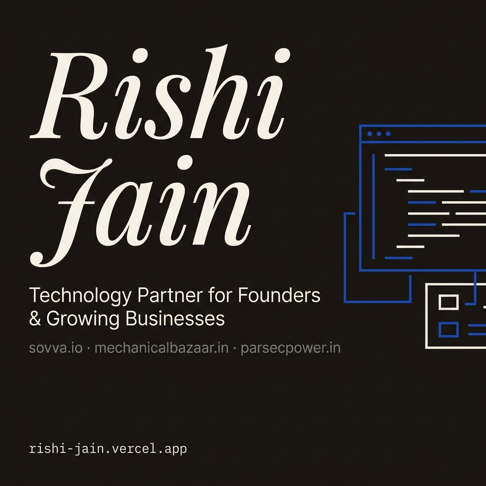

# Rishi Jain — Portfolio & Technology Partner

  

## 🌐 The Live Platform

**Live Portfolio:** [rishi-jain.vercel.app](https://rishi-jain.vercel.app)

This repository holds the source code for my personal portfolio and consulting platform. It is engineered not just as a brochure, but as a high-performance, SEO-optimized web application designed to rank and convert.

---

## 🏗 Architecture & Engineering Choices

This platform was built with a relentless focus on **speed, Core Web Vitals, and Semantic SEO**.

### 1. Framework & Rendering
- Built on **React + Vite** for lightning-fast HMR and minimal bundle sizes.
- **Component-Driven Design:** Everything is modularized into pure UI components (`<Button>`, `<Card>`, `<Section>`) separating business data from presentation.

### 2. Pro-Level SEO & The "Invisible Layer"
Most developer portfolios fail at distribution. This platform is built for visibility:
- **Zero-JS Crawler Fallback:** A `<noscript>` block in the `index.html` feeds LLMs (ChatGPT/Claude/Gemini) and legacy crawlers the complete semantic profile of my skills without requiring them to execute JavaScript.
- **WhatsApp/LinkedIn Optimization:** Open Graph (`og:`) and Twitter card tags are hardcoded statically in the HTML root, ensuring instant, rich-media previews when the link is shared on any messaging platform.
- **AI-Targeted FAQ Schema:** The FAQ section is injected with specific questions LLMs and Google's "People Also Ask" system look for (e.g., *"What stack does Rishi Jain use?"*).

### 3. Performance Enhancements
- **Next-Gen Image Formats:** All heavy assets are served as highly compressed `.webp` files.
- **Preconnected Fonts:** Google Fonts (`Playfair Display`, `Inter`) are preconnected at the DNS level in the HTML head to eliminate render-blocking.
- **Progressive Web App (PWA) Ready:** Configured with a full Web App Manifest and favicon suite for mobile pinning.

---

## 💼 About Rishi Jain

I am a Technology Partner and Software Engineer based in India. I specialize in taking complex business processes and turning them into scalable, automated software systems. 

My background bridges two worlds:
1. **Enterprise FinTech (Infosys):** Where I learned the absolute necessity of rigorous testing, secure API architecture, and code that cannot afford to fail.
2. **SaaS Founder (Sovva):** Where I learned that code doesn't matter if it doesn't solve a real business problem, drive revenue, or save time.

### The Stack I Deploy
* **Backend:** `.NET 8`, `C#`, `PostgreSQL`, `Entity Framework Core`, `Hangfire`
* **Frontend:** `Angular`, `React`, `TypeScript`, `TailwindCSS`
* **Cloud:** `Azure`, `Vercel`, `Docker`

---

### Contact & Collaboration
If you are a founder, agency, or growing business looking to stop fighting your current software and start building systems that scale with you — let's talk.

📧 [jainnrishii21@gmail.com](mailto:jainnrishii21@gmail.com)  
🔗 [LinkedIn](https://www.linkedin.com/in/rishi-jainn/)
